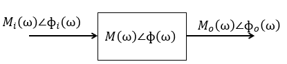

19 / 09 / 2024
# Análisis en Frecuencia y Diagramas de Bode
El análisis en frecuencia es un método utilizado para examinar cómo un sistema responde a señales sinusoidales de diferentes frecuencias. Su objetivo es comprender el comportamiento del sistema en el dominio de la frecuencia, en lugar de analizar su evolución en el tiempo [1].
El diagrama de Bode proporciona una visión clara del funcionamiento y comportamiento de un sistema físico, ofreciendo información clave sobre su estabilidad. Esto es fundamental para el diseño de controladores eficientes en los procesos pertinentes. Además, permite identificar las zonas óptimas de operación y destacar las áreas donde es necesario evitar dinámicas no deseadas. [2]

## 1. Analisis en Frecuencia
- Una forma de estudiar los sistemas dinámicos es observar cómo responde la salida cuando se varía la frecuencia en la entrada.
- La señal seno $$\( R = A \sin(\omega kT + \theta) \)$$ se aplica bajo el supuesto de que el sistema tiene un comportamiento lineal.
- No se deben realizar cambios en la frecuencia de entrada. Si ocurren perturbaciones, estas provocarán variaciones en la amplitud y fase de la señal de salida.
  
## ¿Qué cambios se pueden producir?
* Salida sinusoidal con amplitud proporcional.
* Armónicos igual frecuencia que a la entreda.
* Variaciones en amplitud y frecuencia.
* Ángulo de Fase y Amplitud, comportamiento a los cambios.

Para la representación matemática, las señales sinusoidales se expresan mediante fasores. Bajo la suposición de una frecuencia constante, los fasores describen la señal únicamente en términos de amplitud y fase. La entrada y salida se representa en fasores, representando el sistema como:

$$ R = A \sin(\omega kT + \theta)$$

La frecuencia constante e implicita

$$ R = A \measuredangle \varphi $$

# 💡Ejemplo 1

Figura 1. Dominio en frecuencia.

$$M_{o}$$, $$M_{i}$$: Magnitudes que estan representadas en el dominio de la frecuencia.

Entrada: $$M_{i} \measuredangle_{i} \phi (\omega) $$

Salida: $$M_{o} \measuredangle_{o} \phi (\omega) $$

La relación entre la entrada y la salida determina el sistema que transforma la señal de entrada, el cual se ve afectado por los cambios en la frecuencia.

$$\frac{M_{o} \measuredangle_{o} \phi (\omega)}{M_{i} \measuredangle_{i} \phi (\omega)} = M \measuredangle \phi(\omega) $$

Con base en la información presentada anteriormente, se representa una señal senoidal en forma de fasores.

Se tiene en cuenta:

$$A_{1} \measuredangle \varphi_{1}$$ para la entrada y $$A_{2} \measuredangle \varphi_{2}$$ para la salida del sistema

* Entrada: $$A_{1} \sin(\omega_{1} kT + \varphi {1})$$
* Salida: $$A_{2} \sin(\omega_{2} kT + \varphi {2})$$
* $$G_{(s)} = \frac{A_{2} \measuredangle \varphi_{2}}{A_{1} \measuredangle \varphi_{1}} = M \measuredangle \varphi $$
* $$M = \frac{A_{2}}{A_{1}}$$
* $$\varphi = \varphi_{2} - \varphi_{1}$$

Se determina que $$\varphi$$ no depende de la frecuencia

## Función de transferencia en términos de la frecuencia

Partiendo de un sistema continuo $$(s = j\omega)$$ y su equivalencia para el mapeo de polos y zeros $$(z = e^{sT})$$. Se determina que al colocar la variable $$z$$ en términos de frecuencia se obtiene:

$$z = e^{j\omega T}$$

# 💡Ejemplo 2
* Tiempo de muestro = 0.1 seg

$$H_{z} = \frac{1}{(z - 0.1)(z - 5)}$$

* Se expresa en el dominio de la frecuencia:

$$H(e^{j\omega T}) = \frac{1}{(e^{j\omega T} - 0.1)(e^{j\omega T} - 5)} 
$$

$$H(e^{j\omega T}) = \frac{1}{(Cos(\omega T) + jSen(\omega T)-0.1)(Cos(\omega T) + jSen(\omega T)-5)} $$

$$H(e^{j\omega T}) = \frac{1}{Cos^{2}(\omega T)- Sen^{2}(\omega T)-5,1Sen(\omega T) - 5,1Cos(\omega T) + 0,5 + {\color{blue} j2Cos(\omega T)Sen(\omega T)}} $$

Se identifican la parte real y la parte imaginaria, destacada en azul.

# Diagrama de Frecuencia
Cualquier función de transferencia puede descomponerse en sus partes real e imaginaria. De esta manera, es posible determinar la magnitud y la fase en el dominio de la frecuencia.
Cabe aclarar que depende del diagrama:
* Magnitud y Fase en función de la Frecuencia: Se utilizan dos escalas para su representación: la escala lineal y la escala logarítmica. Esta última se mide en decibelios
>  🔑 Definición: Los decibelios son unidades comúnmente empleadas para analizar amplios rangos de frecuencias.

* Magnitud con respecto a la fase: Se determinan las coordenadas en el sistema polar.

# Diagramas de Bode

##  Diagramas de frecuencia
Trabaja distintos diagramas -> Analizando
 |----> Fase y amplitud 

- Depende del diagrama:
  Escala lineal
  Escala logaritmica
La mafgnitud y fase con respecto a la frecuencia

dB -> Se trabaja con Baudios (dB) -> Potencia o ganacia
Analizar rangos de frecuencia muy grandes

$$A_{dB} = 20log_{10}A$$
- Magnitud con respecto a la fase
- Coordenadas polares

##  Referencias
[1]. R. Hossain, “Control System By Norman nise Sixth Ed”, 2017.
[2]	S. A. Castaño Giraldo, “Diagrama de Bode”, Control Automático Educación, 05-oct-2019. [En línea]. Disponible en: https://controlautomaticoeducacion.com/control-realimentado/1-diagrama-de-bode/. [Consultado: 28-sep-2024].

