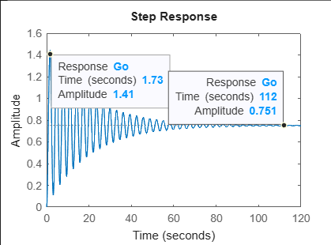
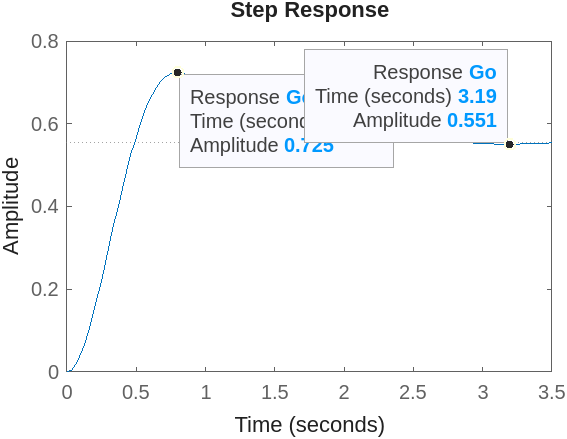

19 / 09 / 2024
# Análisis en Frecuencia y Diagramas de Bode
El análisis en frecuencia es un método utilizado para examinar cómo un sistema responde a señales sinusoidales de diferentes frecuencias. Su objetivo es comprender el comportamiento del sistema en el dominio de la frecuencia, en lugar de analizar su evolución en el tiempo [1].
El diagrama de Bode proporciona una visión clara del funcionamiento y comportamiento de un sistema físico, ofreciendo información clave sobre su estabilidad. Esto es fundamental para el diseño de controladores eficientes en los procesos pertinentes. Además, permite identificar las zonas óptimas de operación y destacar las áreas donde es necesario evitar dinámicas no deseadas. [2]

## 1. Analisis en Frecuencia
- Una forma de estudiar los sistemas dinámicos es observar cómo responde la salida cuando se varía la frecuencia en la entrada.
- La señal seno $$\( R = A \sin(\omega kT + \theta) \)$$ se aplica bajo el supuesto de que el sistema tiene un comportamiento lineal.
- No se deben realizar cambios en la frecuencia de entrada. Si ocurren perturbaciones, estas provocarán variaciones en la amplitud y fase de la señal de salida.
  
## ¿Qué cambios se pueden producir?
* Salida sinusoidal con amplitud proporcional.
* Armónicos igual frecuencia que a la entreda.
* Variaciones en amplitud y frecuencia.
* Ángulo de Fase y Amplitud, comportamiento a los cambios.

Para la representación matemática, las señales sinusoidales se expresan mediante fasores. Bajo la suposición de una frecuencia constante, los fasores describen la señal únicamente en términos de amplitud y fase. La entrada y salida se representa en fasores, representando el sistema como:

$$ R = A \sin(\omega kT + \theta)$$

La frecuencia constante e implicita

$$ R = A \measuredangle \varphi $$

💡**Ejemplo 1:**

Figura 1. Dominio en frecuencia.

$$M_{o}$$, $$M_{i}$$: Magnitudes que estan representadas en el dominio de la frecuencia.

Entrada: $$M_{i} \measuredangle_{i} \phi (\omega) $$

Salida: $$M_{o} \measuredangle_{o} \phi (\omega) $$

La relación entre la entrada y la salida determina el sistema que transforma la señal de entrada, el cual se ve afectado por los cambios en la frecuencia.

$$\frac{M_{o} \measuredangle_{o} \phi (\omega)}{M_{i} \measuredangle_{i} \phi (\omega)} = M \measuredangle \phi(\omega) $$

Con base en la información presentada anteriormente, se representa una señal senoidal en forma de fasores.

Se tiene en cuenta:

$$A_{1} \measuredangle \varphi_{1}$$ para la entrada y $$A_{2} \measuredangle \varphi_{2}$$ para la salida del sistema

* Entrada: $$A_{1} \sin(\omega_{1} kT + \varphi {1})$$
* Salida: $$A_{2} \sin(\omega_{2} kT + \varphi {2})$$
* $$G_{(s)} = \frac{A_{2} \measuredangle \varphi_{2}}{A_{1} \measuredangle \varphi_{1}} = M \measuredangle \varphi $$
* $$M = \frac{A_{2}}{A_{1}}$$
* $$\varphi = \varphi_{2} - \varphi_{1}$$

Se determina que $$\varphi$$ no depende de la frecuencia

## Función de transferencia en términos de la frecuencia

Partiendo de un sistema continuo $$(s = j\omega)$$ y su equivalencia para el mapeo de polos y zeros $$(z = e^{sT})$$. Se determina que al colocar la variable $$z$$ en términos de frecuencia se obtiene:

$$z = e^{j\omega T}$$

💡**Ejemplo 2:**
* Tiempo de muestro = 0.1 seg

$$H_{z} = \frac{1}{(z - 0.1)(z - 5)}$$

* Se expresa en el dominio de la frecuencia:

$$H(e^{j\omega T}) = \frac{1}{(e^{j\omega T} - 0.1)(e^{j\omega T} - 5)} 
$$

$$H(e^{j\omega T}) = \frac{1}{(Cos(\omega T) + jSen(\omega T)-0.1)(Cos(\omega T) + jSen(\omega T)-5)} $$

$$H(e^{j\omega T}) = \frac{1}{Cos^{2}(\omega T)- Sen^{2}(\omega T)-5,1Sen(\omega T) - 5,1Cos(\omega T) + 0,5 + {\color{blue} j2Cos(\omega T)Sen(\omega T)}} $$

Se identifican la parte real y la parte imaginaria, destacada en azul.

# Diagrama de Frecuencia
Cualquier función de transferencia puede descomponerse en sus partes real e imaginaria. De esta manera, es posible determinar la magnitud y la fase en el dominio de la frecuencia.
Cabe aclarar que depende del diagrama:
* Magnitud y Fase en función de la Frecuencia: Se utilizan dos escalas para su representación: la escala lineal y la escala logarítmica. Esta última se mide en decibelios
>  🔑 Definición: Los decibelios son unidades comúnmente empleadas para analizar amplios rangos de frecuencias. Ademas no son una unidad física, permiten la interpolación como potencia o ganancia. 

* Magnitud con respecto a la fase: Se determinan las coordenadas en el sistema polar.
>  🔑 Las coordenadas polares pueden generar espirales.

## Efectos de parámetros dinámicos
No es posible llevar a cabo un análisis en frecuencia de manera adecuada en le dominio del tiempo discreto. Para realziar un análisis frecuencial correcto se utiliza la transformación bilineal de Tustin, el proporciona una aproximación del comportamiento del sistema en el dominio del tiempo continuo.
* Transformación bilineal (Tustin):
  
  $$w = \frac{2z - 1}{Tz + 1}$$
  
  $$z = \frac{1 + \frac{wT}{2}}{1 - \frac{wT}{2}}$$
* Al reemplazar $$z = e^{j\omega T}$$:
  
  $$w = j\frac{2}{T}tan(\frac{\omega T}{2})$$

* Sustituyendo $$w = jv$$:

  $$v = \frac{2}{T}tan(\frac{\omega T}{2})$$

Para una mayor comprensión de lo que se realizó anteriormente se presentan las graficas resultantes de los planos complejos $$s$$ y $$z$$, pasando de tiempo continuo a tiempo discreto.

Figura 2. Análisis frecuencia en tiempo discreto.

La ecuación $$w = \frac{2}{T}\frac{z - 1}{z + 1}$$ representa la relación entre la frecuencia discreta y continua. 

De la Figura 2 se puede interpretar que, en el plano z (Círculo Unitario), cuanto más cerca del origen (0) esté el sistema, más rápido será su comportamiento. Esto es lo opuesto a lo que sucede en el dominio del tiempo continuo y su valor máximo es 1.

💡**Ejemplo 3:**

* Se tiene un sistema en tiempo continuo:

$$G_{s} = \frac{1}{s  +10}$$

* Se puede obtener la aproximación discreta (ZOH), con T = 0.1 seg.

$$G_{z} = \frac{0.06321}{z - 03679}$$

* Se aplica la transformada $$w$$:

$$G_{w} = \frac{0.924(-0.05w + 1)}{w + 9.242}$$

* A partir de la función de transferencia obtenida, se identifica un cero que no estaba presente en el sistema original.
* El polo y la ganancia se encuentran ubicados aproximadamente en las mismas posiciones que en el sistema continuo.
* Al reducir el tiempo de muestreo, se incrementa la frecuencia.

💡**Ejemplo 4:**

Encuentre el equivalente en términos de la variable w 
para la planta $$G_{(s)} = \frac{8}{s^{2} + 6}$$ con T = 0.9seg

* $$G_{(s)} = \frac{8}{s^{2} + 6}$$
* $$G_{(z)} = \frac{8}{(\frac{z-1}{0.9})^{2} + 6}$$
* $$G_{(z)} = \frac{6,48}{z^{2} - 2z + 5,86}$$
* $$G_{(w)} = \frac{6,48}{(\frac{1 + \frac{wT}{2}}{1 - \frac{wT}{2}})^{2} - \frac{2 + wT}{1 - \frac{wT}{2}} + 5,86}$$

# Diagramas de Bode
Es fundamental para optimizar el rendimiento de un sistema de lazo cerrado. Permite graficar la respuesta en frecuencia del lazo abierto [3]. Se obtienen a partir de los cambios que tiene el sistema en magnitud de su ganancia y su ángulo de desfase frente a cambios en la frecuencia de la señal de entrada.

Para los sistemas discretos es importante tener en cuenta que los compensadores que se diseñan pierden eficacia en frecuencias altas, esto se debe a la transformada w.

* Pico resonante:

$$Mr = \frac{1}{2 \xi^{2}}$$ 

$$\xi < 0.707$$

$$Mr = 1$$ 

$$\xi \geq  0.707$$

💡**Ejemplo 5:**

$$G = \frac{3}{w^{2} + 0.1w + 1}$$

* Función de transferencia lazo cerrado

$$G_{o} = \frac{G}{1 + G} = \frac{3}{w^2 + 0.1w + 4}$$

* Se calcula el overshoot y el \xi del sistema:

Figura 3. Lazo Cerrado - Ejemplo 5.

$$Mp = \frac{1.41 - 0.751}{0.751 - 0} = 0.877$$

$$\xi = \sqrt{\frac{ln^2(0.877)}{\pi^2+ln^2(0.877)}} = 0.0414$$

$$Mp = 0.877$$

$$\xi = 0.0414$$

$$Mr = \frac{1}{2\sqrt{\frac{ln^2(0.877)}{\pi^2+ln^2(0.877)}}\sqrt{1 -\frac{ln^2(0.877)}{\pi^2+ln^2(0.877)}}} = 12.03 dB$$

💡**Ejemplo 6:**

$$G = \frac{10}{w^{2} + 3w + 8}$$

* Función de transferencia lazo cerrado

$$G_{o} = \frac{G}{1 + G} = \frac{10}{w^2 + 3w + 18}$$

* Se calcula el overshoot y el \xi del sistema:

Figura 4. Lazo Cerrado - Ejemplo 6.

$$Mp = \frac{0.725 - 0.551}{0.551 - 0} = 0.316 $$

$$\xi = \sqrt{\frac{ln^2(0.316)}{\pi^2+ln^2(0316.)}} = 0.344$$

$$Mp = 0.316$$

$$\xi = 0.344$$

$$Mr = \frac{1}{2\sqrt{\frac{ln^2(0.316)}{\pi^2+ln^2(0.316)}}\sqrt{1 -\frac{ln^2(0.316)}{\pi^2+ln^2(0.316)}}} = 1.63 dB$$

# Conclusiones
* El más mínimo cambio en la frecuencia de entrada puede generar alteraciones en el diseño del controlador, lo que resulta en un sistema erróneo. Por ello, es crucial considerar y anticipar cualquier posible variación que pueda afectar al sistema.
* El uso de coordenadas polares en diagramas de frecuencia, puede generar trayectorias en forma de espiral que reflejan el comportamiento dinámico de sistemas con polos y ceros en el plano complejo. Por ende, es crucial el correcto analisis para evaluar la estabilidad del sistema.

##  Referencias
[1]. R. Hossain, “Control System By Norman nise Sixth Ed”, 2017.

[2]	S. A. Castaño Giraldo, “Diagrama de Bode”, Control Automático Educación, 05-oct-2019. [En línea]. Disponible en: https://controlautomaticoeducacion.com/control-realimentado/1-diagrama-de-bode/. [Consultado: 28-sep-2024].

[3]	“Diagrama de Bode”, Mathworks.com. [En línea]. Disponible en: https://la.mathworks.com/discovery/bode-plot.html. [Consultado: 28-sep-2024].

